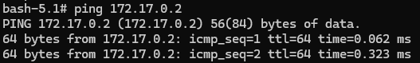

## Search and download image  
docker search rockylinux  
docker pull rockylinux:9.3  
docker search almalinux  
docker pull almalinux  
## Viewing images  
docker images  
## Creating containers with the ability to use the shell  
docker create --tty --interactive --name almalinux-lab almalinux  
docker create --tty --interactive --name rockylinux-lab rockylinux:9.3  
## Launching containers  
docker start rockylinux-lab  
docker start almalinux-lab  
## How to check the IP addresses of containers in the default bridge network?
docker network inspect bridge

    almalinux-lab - 172.17.0.2/16  
    rockylinux-lab  - 172.17.0.3/16  
## Container shell entry and checking the network connection between containers  
docker exec -it rockylinux-lab /bin/bash  
apt-get install iputils-ping -y  
ping 172.17.0.2  

  

