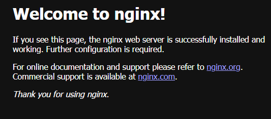

# Introduction to Docker
## Search and download image 
```bash
docker search rockylinux  
docker pull rockylinux:9.3  
docker search almalinux  
docker pull almalinux  
``` 
## Viewing images  
```bash
docker images
```
## Creating containers with the ability to use the shell  
```bash
docker create --tty --interactive --name almalinux-lab almalinux  
docker create --tty --interactive --name rockylinux-lab rockylinux:9.3  
```
## Launching containers 
```bash 
docker start rockylinux-lab  
docker start almalinux-lab  
```
## How to check the IP addresses of containers in the default bridge network?
```bash
docker network inspect bridge
```

almalinux-lab - 172.17.0.2/16  
rockylinux-lab  - 172.17.0.3/16  
## Container shell entry and checking the network connection between containers  
```bash
docker exec -it rockylinux-lab /bin/bash  
apt-get install iputils-ping -y  
ping 172.17.0.2  
```
  

# NGINX
```bash
docker search nginx
docker pull nginx:1.27.5
docker run -it --rm -d -p 8080:80 --name hello-nginx nginx  
```
Open browser and type http://localhost:8080/ .

  